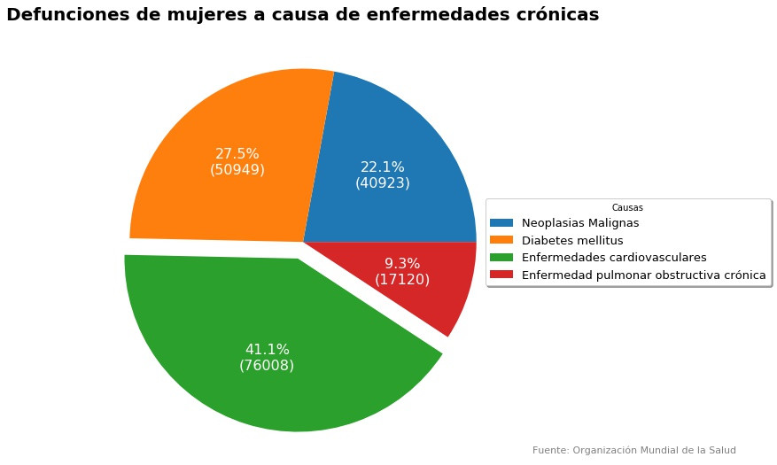
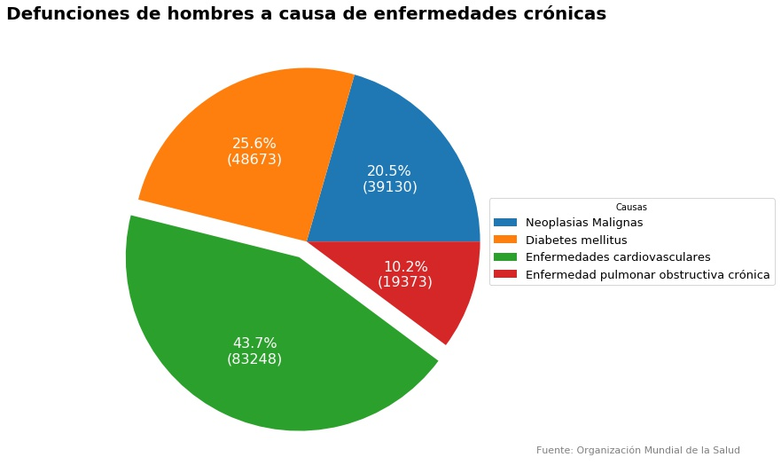

# Proyecto Final
### Sistema de predicción de riesgos de enfermedades cardiovasculares. 

Las enfermedades cardiovasculares (ECV) son un conjunto de trastornos del corazón y de los vasos sanguíneos. De acuerdo con la Organización Mundial de la Salud (OMS) son la principal causa de muerte en el mundo, las cifras de defunciones tanto en hombres como en mujeres abarcan más del 40% de las enfermedades crónicas. 

A pesar de que los factores de riesgo son conocidos, es muy habitual que los síntomas se confundan y que las enfermedades se reconozcan únicamente cuando el estado de salud se ha deteriorado. Debido a que no existe una fórmula ni una manera para predecir manualmente cómo es que esos factores son responsables de una ECV, una herramienta que puede ser implementada para la prevención y detección temprana de este tipo de enfermedades es la ciencia de datos, particularmente aplicando técnicas de Machine Learning. 

### Datos utilizados

###### Visualización de datos

Para la realización de gráficas para la comprensión del problema, así como para tener una idea general del problema, se utilizaron bases de datos obtenidas de la página oficial de la OMS, así como datos obtenidos de la Secretaría de Salud. (Carpeta Datos)

###### Entrenamiento del modelo y análisis exploratorio de datos.

Para el entrenamiento del modelo, se utilizó una base de datos de 70,000 pacientes, perteneciente a una base de datos de kaggle.com Esta base contaba con 12 tipos de datos de pacientes, como son: 

* ID: para identificar al paciente

* Edad del paciente

* Género del paciente (1= hombre, 2= mujer)

* Peso del paciente (en kg)

* Estatura del paciente (en cm)

* Presión sistólica

* Presión diastólica

* Nivel de glucosa

  Considerando [1: Bajo (<110 mg/dl) 2: Medio (110 - 130 mg/dl) 3: Alto (>130 mg/dl)]

* Nivel de colesterol

  Considerando [1: Bajo (<200 mg/dl) 2: Medio (200 - 240 mg/dl) 3: Alto (>240 mg/dl)]

También incluye tres factores de riesgo, clasificados con (1 y 0) :

* Consumo de tabaco
* Consumo de alcohol
* Realización de actividad física

### Entrenamiento del modelo

